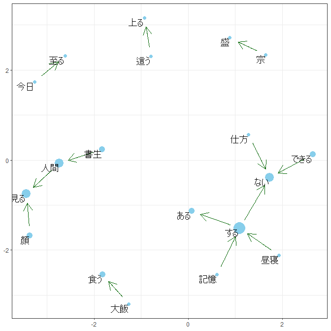
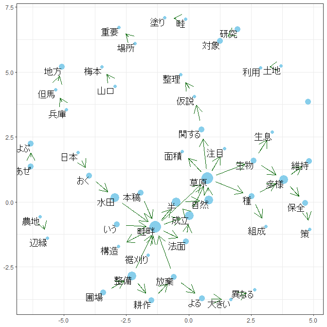

# moranajp はじめに

The goal of moranajp is a tool of morphological analysis for Japanese.

moranajpは，日本語形態素解析をするためのものです．

## Installation インストール

You can install the released version of moranajp from \[GitHub\] (
<https://github.com/matutosi/moranajp> ). You need install MeCab (
<https://taku910.github.io/mecab/> ).

最新バージョンは，\[GitHub\] ( <https://github.com/matutosi/moranajp> )
でダウンロードできます． MeCab ( <https://taku910.github.io/mecab/> )
を別途インストールする必要があります．

``` r
  # CRAN
install.packages("moranajp")

  # development
  # install.packages("devtools")
devtools::install_github("matutosi/moranajp")
```

## Example 使用例

``` r
library(moranajp)
library(magrittr)

data(neko)
neko <- unescape_utf(neko)
head(neko) # 『吾輩は猫である』(夏目漱石)の冒頭部分
#> # A tibble: 6 × 1
#>   text                                                                         
#>   <chr>                                                                        
#> 1 吾輩は猫である。名前はまだ無い。                                             
#> 2 どこで生れたかとんと見当がつかぬ。何でも薄暗いじめじめした所でニャーニャー泣…
#> 3 この書生の掌の裏でしばらくはよい心持に坐っておったが、しばらくすると非常な速…
#> 4 ふと気が付いて見ると書生はいない。たくさんおった兄弟が一疋も見えぬ。肝心の母…
#> 5 ようやくの思いで笹原を這い出すと向うに大きな池がある。吾輩は池の前に坐ってど…
#> 6 吾輩の主人は滅多に吾輩と顔を合せる事がない。職業は教師だそうだ。学校から帰る…

  # MeCab (Need install MeCab) 
  # MeCabをインストールする必要あり
bin_dir <- "d:/pf/mecab/bin" # set your environment MeCabをインストールしたフォルダを指定
  # bin_dir <- "/opt/local/mecab/bin/"  # Example for Mac or Linux
iconv <- "CP932_UTF-8"       # maybe need in Windows Windowsで必要な場合あり
  # 文字化けする場合は，引数 iconv を使ってください．
  # `iconv = "CP932_UTF-8"` or `iconv = "EUC_UTF-8"`
neko |>
  moranajp_all(text_col = "text", bin_dir = bin_dir, iconv = iconv) |>
  print(n=30)
#> [1] "Analaysing by mecab. Please wait."
#> # A tibble: 2,884 × 11
#>    text_id 表層形  品詞  品詞…¹  品詞…²  品詞…³ 活用型  活用形 原形  読み  発音 
#>      <dbl> <chr>   <chr> <chr>   <chr>   <chr>  <chr>   <chr>  <chr> <chr> <chr>
#>  1       1 吾輩    名詞  代名詞  一般    *      *       *      吾輩  ワガ… ワガ…
#>  2       1 は      助詞  係助詞  *       *      *       *      は    ハ    ワ   
#>  3       1 猫      名詞  一般    *       *      *       *      猫    ネコ  ネコ 
#>  4       1 で      助動… *       *       *      特殊・… 連用形 だ    デ    デ   
#>  5       1 ある    助動… *       *       *      五段・… 基本形 ある  アル  アル 
#>  6       1 。      記号  句点    *       *      *       *      。    。    。   
#>  7       1 名前    名詞  一般    *       *      *       *      名前  ナマ… ナマ…
#>  8       1 は      助詞  係助詞  *       *      *       *      は    ハ    ワ   
#>  9       1 まだ    副詞  助詞類… *       *      *       *      まだ  マダ  マダ 
#> 10       1 無い    形容… 自立    *       *      形容詞… 基本形 無い  ナイ  ナイ 
#> 11       1 。      記号  句点    *       *      *       *      。    。    。   
#> 12       2 どこ    名詞  代名詞  一般    *      *       *      どこ  ドコ  ドコ 
#> 13       2 で      助詞  格助詞  一般    *      *       *      で    デ    デ   
#> 14       2 生れ    動詞  自立    *       *      一段    連用形 生れ… ウマ… ウマ…
#> 15       2 た      助動… *       *       *      特殊・… 基本形 た    タ    タ   
#> 16       2 か      助詞  副助詞… *       *      *       *      か    カ    カ   
#> 17       2 とんと  副詞  一般    *       *      *       *      とん… トン… トン…
#> 18       2 見当    名詞  サ変接… *       *      *       *      見当  ケン… ケン…
#> 19       2 が      助詞  格助詞  一般    *      *       *      が    ガ    ガ   
#> 20       2 つか    動詞  自立    *       *      五段・… 未然形 つく  ツカ  ツカ 
#> 21       2 ぬ      助動… *       *       *      特殊・… 基本形 ぬ    ヌ    ヌ   
#> 22       2 。      記号  句点    *       *      *       *      。    。    。   
#> 23       2 何      名詞  代名詞  一般    *      *       *      何    ナニ  ナニ 
#> 24       2 でも    助詞  副助詞  *       *      *       *      でも  デモ  デモ 
#> 25       2 薄暗い  形容… 自立    *       *      形容詞… 基本形 薄暗… ウス… ウス…
#> 26       2 じめじ… 副詞  一般    *       *      *       *      じめ… ジメ… ジメ…
#> 27       2 し      動詞  自立    *       *      サ変・… 連用形 する  シ    シ   
#> 28       2 た      助動… *       *       *      特殊・… 基本形 た    タ    タ   
#> 29       2 所      名詞  非自立  副詞可… *      *       *      所    トコ… トコ…
#> 30       2 で      助詞  格助詞  一般    *      *       *      で    デ    デ   
#> # … with 2,854 more rows, and abbreviated variable names ¹​品詞細分類1,
#> #   ²​品詞細分類2, ³​品詞細分類3

  # chamame (Do not need install, but use web service)
  # 別途ツールのインストールのなし(Web茶まめを使用)
neko |>
  head(3) |>
  moranajp_all(method = "chamame", text_col = "text") |>
  print(n=30)
#> [1] "Analaysing by chamame. Please wait."
#> Submitting with ''
#> # A tibble: 393 × 7
#>    text_id 表層形   品詞     品詞細分類1  品詞細分類2 品詞細分類3 原形    
#>      <dbl> <chr>    <chr>    <chr>        <chr>       <chr>       <chr>   
#>  1       1 吾輩     代名詞   ""           ""          ""          吾輩    
#>  2       1 は       助詞     "係助詞"     ""          ""          は      
#>  3       1 猫       名詞     "普通名詞"   "一般"      ""          猫      
#>  4       1 で       助動詞   ""           ""          ""          だ      
#>  5       1 ある     動詞     "非自立可能" ""          ""          ある    
#>  6       1 。       補助記号 "句点"       ""          ""          。      
#>  7       1 名前     名詞     "普通名詞"   "一般"      ""          名前    
#>  8       1 は       助詞     "係助詞"     ""          ""          は      
#>  9       1 まだ     副詞     ""           ""          ""          まだ    
#> 10       1 無い     形容詞   "非自立可能" ""          ""          無い    
#> 11       1 。       補助記号 "句点"       ""          ""          。      
#> 12       2 どこ     代名詞   ""           ""          ""          どこ    
#> 13       2 で       助詞     "格助詞"     ""          ""          で      
#> 14       2 生れ     動詞     "一般"       ""          ""          生れる  
#> 15       2 た       助動詞   ""           ""          ""          た      
#> 16       2 か       助詞     "終助詞"     ""          ""          か      
#> 17       2 と       助詞     "格助詞"     ""          ""          と      
#> 18       2 んと     感動詞   "フィラー"   ""          ""          んと    
#> 19       2 見当     名詞     "普通名詞"   "一般"      ""          見当    
#> 20       2 が       助詞     "格助詞"     ""          ""          が      
#> 21       2 つか     動詞     "非自立可能" ""          ""          つく    
#> 22       2 ぬ       助動詞   ""           ""          ""          ぬ      
#> 23       2 。       補助記号 "句点"       ""          ""          。      
#> 24       2 何       代名詞   ""           ""          ""          何      
#> 25       2 で       助詞     "格助詞"     ""          ""          で      
#> 26       2 も       助詞     "係助詞"     ""          ""          も      
#> 27       2 薄暗い   形容詞   "一般"       ""          ""          薄暗い  
#> 28       2 じめじめ 副詞     ""           ""          ""          じめじめ
#> 29       2 し       動詞     "非自立可能" ""          ""          する    
#> 30       2 た       助動詞   ""           ""          ""          た      
#> # … with 363 more rows
```

``` r
library(moranajp)
library(magrittr)

data(synonym)
synonym <- unescape_utf(synonym)

data(neko_mecab)
neko_mecab <- 
  neko_mecab  |>
  unescape_utf() |>
  add_sentence_no() |>
  clean_up(use_common_data = TRUE, synonym_df = synonym)
#> Joining with `by = join_by(原形)`

bigram_neko <- 
  neko_mecab |>
  draw_bigram_network()
#> Joining with `by = join_by(原形)`
```



``` r

add_stop_words <- 
  c("\\u3042\\u308b", "\\u3059\\u308b", "\\u3066\\u308b", 
    "\\u3044\\u308b","\\u306e", "\\u306a\\u308b", "\\u304a\\u308b", 
    "\\u3093", "\\u308c\\u308b", "*") |> 
   unescape_utf()

data(review_chamame)
bigram_review <- 
  review_chamame |>
  dplyr::slice(1:2000) |>
  unescape_utf() |>
  add_sentence_no() |>
  clean_up(add_stop_words = add_stop_words) |>
  draw_bigram_network()
#> Joining with `by = join_by(原形)`
#> Joining with `by = join_by(原形)`
```



## Note 注意点

Line breaks in the text will be removed to avoid lag text id. If you
want to remain line breaks, please change them into other character.

文字列内の改行コード(,
)は，削除されます(改行コードでずれるのを防ぐため)．
改行コードに意味がある場合は，事前に改行コードを別の文字列に変更するなどの対応をしてください．

## Citation 引用

Toshikazu Matsumura (2021) Morphological analysis for Japanese with R.
<https://github.com/matutosi/moranajp/>.

松村 俊和 (2021) Rによる日本語形態素解析.
<https://github.com/matutosi/moranajp/>.

## Installation of MeCab for (Linux / Mac) MeCabのインストール(Linux / Mac)

download file (mecab-0.996.tar.gz, mecab-ipadic-2.7.0-20070801.tar.gz)

ファイルのダウンロード(mecab-0.996.tar.gz,
mecab-ipadic-2.7.0-20070801.tar.gz)

<http://taku910.github.io/mecab/#download>

      tar xvf mecab-0.996.tar.gz
      cd mecab-0.996
      ./configure --enable-utf8-only --prefix=/opt/local/mecab
      make
      sudo make install
      # install directory
      # 辞書のインストール
      tar xvf mecab-ipadic-2.7.0-20070801.tar.gz
      cd mecab-ipadic-2.7.0-20070801
      ./configure  --with-mecab-config=/opt/local/mecab/bin/mecab-config --with-charset=utf8 --prefix=/opt/local/mecab
      make
      sudo make install
      # add path
      # パスの追加
      echo 'export PATH=/opt/local/mecab/bin:$PATH' >> ~/.bash_profile
      source ~/.bash_profile
      # run mecab
      # mecabの実行
      mecab

ref (in Japanese) 参考
<https://qiita.com/nkjm/items/913584c00af199794257>
